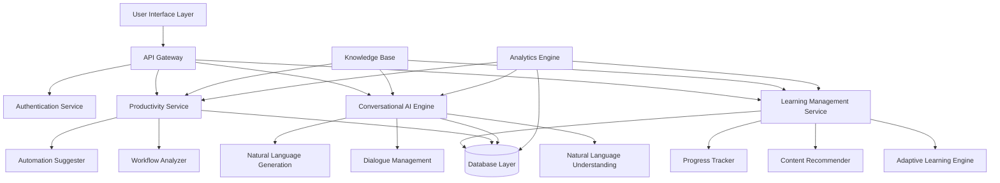

# Design Document: AI Learning Assistant

## Overview

The AI Learning Assistant is a sophisticated system that leverages modern artificial intelligence techniques to provide personalized learning experiences and productivity enhancement for technology professionals and learners. The system combines adaptive learning algorithms, natural language processing, and intelligent content recommendation to create a comprehensive learning and productivity platform.

Based on current research in AI-powered education, the system employs proven patterns from successful platforms like Khan Academy's AI personalization and IBM Watson Education's adaptive learning capabilities. The architecture follows established conversational AI design patterns while incorporating specialized components for educational content delivery and productivity optimization.

## Architecture

The system follows a microservices architecture with clear separation of concerns, enabling scalability and maintainability. The core architecture consists of several interconnected services:



### Core Services

1. **Conversational AI Engine**: Handles natural language interactions using modern NLP techniques
2. **Learning Management Service**: Manages personalized learning paths and content delivery
3. **Productivity Service**: Analyzes workflows and suggests optimizations
4. **Knowledge Base Service**: Maintains and serves educational and technical content
5. **Analytics Engine**: Processes user data to improve personalization and recommendations

## Components and Interfaces

### Conversational AI Engine

The conversational AI engine follows established patterns for educational chatbots, implementing a four-pillar architecture:

**Natural Language Understanding (NLU)**
- Intent classification for learning and productivity queries
- Entity extraction for technical terms, concepts, and user context
- Sentiment analysis to gauge user frustration or engagement levels

**Dialogue Management**
- Context-aware conversation state tracking
- Multi-turn dialogue support for complex learning scenarios
- Recovery mechanisms for misunderstood queries

**Natural Language Generation (NLG)**
- Adaptive response generation based on user skill level
- Multi-modal content generation (text, code examples, diagrams)
- Personalized explanation styles

**Interface Definition:**
```typescript
interface ConversationalAI {
  processQuery(query: string, context: UserContext): Promise<AIResponse>
  maintainContext(sessionId: string, context: ConversationContext): void
  generateExplanation(concept: string, userLevel: SkillLevel): Promise<Explanation>
}
```

### Adaptive Learning Engine

Implements proven adaptive learning algorithms based on real-time performance assessment:

**Learning Path Generator**
- Dynamic curriculum adjustment based on user progress
- Prerequisite mapping and skill dependency tracking
- Multi-objective optimization for learning efficiency

**Assessment Engine**
- Continuous assessment through interaction analysis
- Mastery-based progression with configurable thresholds
- Spaced repetition scheduling for knowledge retention

**Interface Definition:**
```typescript
interface AdaptiveLearning {
  generateLearningPath(goals: LearningGoal[], currentSkills: SkillProfile): LearningPath
  assessProgress(userId: string, activity: LearningActivity): ProgressUpdate
  recommendNextContent(userId: string): ContentRecommendation[]
}
```

### Content Recommender

Utilizes collaborative filtering and content-based recommendation algorithms:

**Recommendation Engine**
- Hybrid recommendation combining collaborative and content-based filtering
- Context-aware suggestions based on current learning focus
- Diversity optimization to prevent filter bubbles

**Content Analyzer**
- Automatic content tagging and difficulty assessment
- Learning objective extraction from educational materials
- Quality scoring based on user feedback and engagement metrics

**Interface Definition:**
```typescript
interface ContentRecommender {
  recommendContent(userId: string, context: LearningContext): ContentItem[]
  analyzeContent(content: RawContent): ContentMetadata
  updateRecommendations(userId: string, feedback: UserFeedback): void
}
```

### Productivity Analyzer

Implements workflow analysis and optimization suggestion algorithms:

**Workflow Pattern Recognition**
- Task pattern analysis using machine learning
- Bottleneck identification in user workflows
- Automation opportunity detection

**Suggestion Engine**
- Tool and framework recommendations based on user context
- Process optimization suggestions with impact estimation
- Integration recommendations for existing toolchains

**Interface Definition:**
```typescript
interface ProductivityAnalyzer {
  analyzeWorkflow(workflow: WorkflowDescription): WorkflowAnalysis
  suggestOptimizations(analysis: WorkflowAnalysis): OptimizationSuggestion[]
  recommendTools(context: WorkContext): ToolRecommendation[]
}
```

## Data Models

### User Profile
```typescript
interface UserProfile {
  id: string
  skillProfile: SkillProfile
  learningPreferences: LearningPreferences
  productivityContext: ProductivityContext
  interactionHistory: InteractionRecord[]
}

interface SkillProfile {
  skills: Map<string, SkillLevel>
  learningGoals: LearningGoal[]
  completedContent: ContentItem[]
  assessmentResults: AssessmentResult[]
}

interface LearningPreferences {
  preferredContentTypes: ContentType[]
  learningPace: LearningPace
  difficultyPreference: DifficultyLevel
  interactionStyle: InteractionStyle
}
```

### Learning Content
```typescript
interface ContentItem {
  id: string
  title: string
  type: ContentType
  difficulty: DifficultyLevel
  prerequisites: string[]
  learningObjectives: string[]
  estimatedDuration: number
  content: ContentData
  metadata: ContentMetadata
}

interface LearningPath {
  id: string
  userId: string
  goal: LearningGoal
  milestones: Milestone[]
  currentPosition: number
  adaptationHistory: AdaptationRecord[]
}
```

### Conversation Context
```typescript
interface ConversationContext {
  sessionId: string
  userId: string
  currentTopic: string
  conversationHistory: Message[]
  userIntent: Intent
  extractedEntities: Entity[]
  contextVariables: Map<string, any>
}

interface AIResponse {
  text: string
  suggestions: string[]
  attachments: Attachment[]
  followUpQuestions: string[]
  confidence: number
}
```

### Productivity Data
```typescript
interface WorkflowDescription {
  id: string
  userId: string
  tasks: Task[]
  tools: Tool[]
  timeSpent: Map<string, number>
  painPoints: string[]
}

interface OptimizationSuggestion {
  id: string
  type: OptimizationType
  description: string
  estimatedImpact: ImpactEstimate
  implementationSteps: string[]
  requiredTools: Tool[]
}
```

## Correctness Properties

*A property is a characteristic or behavior that should hold true across all valid executions of a system—essentially, a formal statement about what the system should do. Properties serve as the bridge between human-readable specifications and machine-verifiable correctness guarantees.*

### Property 1: Adaptive Learning Path Generation
*For any* user with specified learning goals and skill level, the AI_Assistant should generate a learning path that is appropriately customized to their goals and current abilities, with content difficulty matching their skill level.
**Validates: Requirements 1.1**

### Property 2: Skill-Appropriate Explanations
*For any* technology concept question and user experience level, the AI_Assistant should provide explanations that are tailored to the user's experience level, with complexity and terminology appropriate to their skill.
**Validates: Requirements 1.2**

### Property 3: Alternative Learning Approaches
*For any* user struggling with a concept (indicated by repeated failures or explicit requests for help), the AI_Assistant should offer alternative explanations and learning approaches different from the initial approach.
**Validates: Requirements 1.3**

### Property 4: Progress-Driven Adaptation
*For any* completed learning activity, the Progress_Tracker should update the user's skill assessment and the updated assessment should influence future content recommendations.
**Validates: Requirements 1.4, 2.2**

### Property 5: Comprehensive Content Recommendation
*For any* new topic, user interest pattern, or time constraint, the Content_Recommender should suggest content that is relevant to the context and appropriately prioritized based on the user's situation.
**Validates: Requirements 2.1, 2.3, 2.4**

### Property 6: Contextual Learning Support
*For any* unfamiliar terminology, code sample, or practice request, the AI_Assistant should provide contextually appropriate support (definitions, explanations, or exercises) based on the user's current learning focus.
**Validates: Requirements 3.1, 3.2, 3.3**

### Property 7: Constructive Feedback Loop
*For any* incorrect answer provided by a user, the AI_Assistant should offer constructive feedback that guides toward the correct solution without simply providing the answer.
**Validates: Requirements 3.4**

### Property 8: Productivity Optimization Analysis
*For any* workflow description or repetitive task scenario, the Productivity_Analyzer should identify optimization opportunities and suggest relevant automation approaches or tools.
**Validates: Requirements 4.1, 4.2, 4.4**

### Property 9: Technical Problem Resolution
*For any* technical problem description, the AI_Assistant should provide troubleshooting guidance that includes systematic solution strategies appropriate to the problem domain.
**Validates: Requirements 4.3**

### Property 10: Comprehensive Progress Tracking
*For any* user interaction with learning materials or assessment completion, the Progress_Tracker should accurately update engagement metrics and skill profiles, maintaining consistency across all tracking data.
**Validates: Requirements 5.1, 5.2**

### Property 11: Insightful Progress Reporting
*For any* progress report request, the Progress_Tracker should generate reports that accurately reflect learning achievements, identify areas needing attention, and suggest optimal study patterns based on historical data.
**Validates: Requirements 5.3, 5.4**

### Property 12: Knowledge Base Integrity
*For any* stored information in the Knowledge_Base, the data should maintain structural consistency, version control, and proper flagging mechanisms for user feedback processing.
**Validates: Requirements 6.1, 6.3, 6.4**

### Property 13: Knowledge Base Currency
*For any* new technology information or user feedback, the Knowledge_Base should properly incorporate updates and maintain accurate currency tracking for all stored information.
**Validates: Requirements 6.2**

### Property 14: Multi-Modal Learning Adaptation
*For any* user learning preference (visual, hands-on, or conceptual), the AI_Assistant should provide content in the appropriate format and use relevant analogies based on the user's background.
**Validates: Requirements 7.1, 7.2, 7.3**

### Property 15: Interaction Mode Support
*For any* user interaction, the AI_Assistant should support both text-based and conversational modes, maintaining functionality across both interaction types.
**Validates: Requirements 7.4**

### Property 16: Context-Aware Assistance
*For any* project context, error scenario, or implementation question, the AI_Assistant should provide advice that considers the user's specific technology stack, constraints, and project requirements.
**Validates: Requirements 8.1, 8.2, 8.3**

### Property 17: Conversation Context Continuity
*For any* multi-turn conversation, the AI_Assistant should maintain context across interactions, providing coherent responses that build upon previous exchanges in the conversation.
**Validates: Requirements 8.4**

## Error Handling

The system implements comprehensive error handling across all components:

### Input Validation
- **Malformed Queries**: Natural language processing handles ambiguous or incomplete user inputs gracefully
- **Invalid Learning Goals**: System validates learning goals against available content and provides suggestions for achievable alternatives
- **Inconsistent User Data**: Data validation ensures user profiles maintain consistency and flags conflicts for resolution

### Service Failures
- **AI Service Unavailability**: Fallback mechanisms provide basic functionality when advanced AI features are unavailable
- **Knowledge Base Errors**: Cached content and alternative sources ensure continued operation during knowledge base issues
- **Recommendation Engine Failures**: Default recommendation strategies activate when personalization services fail

### Data Integrity
- **Corrupted User Profiles**: System detects and repairs inconsistent user data, maintaining backup profiles
- **Content Synchronization Issues**: Version control mechanisms ensure content consistency across distributed components
- **Progress Tracking Errors**: Validation algorithms detect and correct inconsistent progress data

### Recovery Mechanisms
- **Graceful Degradation**: System maintains core functionality even when advanced features are unavailable
- **Automatic Retry Logic**: Transient failures trigger automatic retry with exponential backoff
- **User Notification**: Clear error messages guide users when manual intervention is required

## Testing Strategy

The testing approach combines unit testing for specific functionality with property-based testing for universal correctness guarantees:

### Unit Testing Focus
- **Specific Examples**: Test concrete scenarios like "user asks about Python basics with beginner skill level"
- **Edge Cases**: Test boundary conditions such as empty learning goals or maximum skill levels
- **Integration Points**: Test component interactions and data flow between services
- **Error Conditions**: Test specific failure scenarios and recovery mechanisms

### Property-Based Testing Configuration
- **Testing Framework**: Use Hypothesis (Python) or fast-check (TypeScript) for property-based testing
- **Test Iterations**: Minimum 100 iterations per property test to ensure comprehensive coverage
- **Property Test Tags**: Each test tagged with format: **Feature: ai-learning-assistant, Property {number}: {property_text}**
- **Data Generators**: Custom generators for user profiles, learning content, and conversation contexts

### Comprehensive Coverage Strategy
- **Unit Tests**: Validate specific examples and integration scenarios
- **Property Tests**: Verify universal properties across all possible inputs
- **Performance Tests**: Ensure response times meet user experience requirements
- **Security Tests**: Validate data protection and access control mechanisms

### Test Implementation Requirements
- Each correctness property must be implemented as a single property-based test
- Property tests must generate diverse, realistic test data
- Unit tests complement property tests by covering specific scenarios and edge cases
- All tests must be automated and integrated into continuous integration pipeline